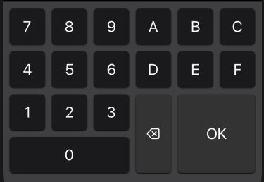
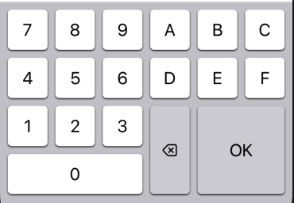
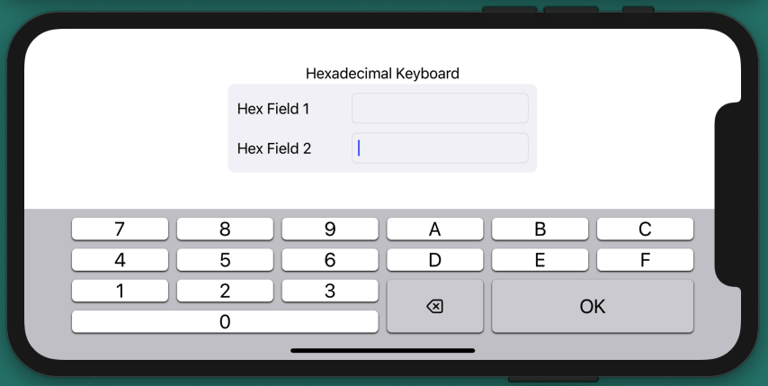

# Hexadecimal Keyboard

A native iOS app creating a custom hexadecimal keyboard.

**Inspiration**\
See same project using a Xib file at [Hexadecimal Keyboard (using Xib file)](https://github.com/PepperoniJoe/HexadecimalKeyboard-Xib)\
Based on the design provided [by David Mulder as seen here](https://ux.stackexchange.com/a/58605/128044)\
And derived from the decimal keyboard code example provided [by Rob as seen here](https://stackoverflow.com/a/57275689/1816667)\
Button styling inspired by Apple's standard keyboard.

**Hexadecimal Layout**(Dark and Light modes)\
\

**Landscape mode**\

**Technical Info:** \
Xcode12  project written in Swift 5 for iOS\
Inputview, UIKeyInput, Textfield custom keyboard\
System colors for dark/light modes

**See Also:** \
[Quickies - a variety of example iOS apps](https://github.com/PepperoniJoe/Quickies)\
 [Make Icons Swiftly - used to generate app icon sets
 ](https://github.com/PepperoniJoe/Make-Icons-Swiftly)
 
**Author:** \
Marcy Vernon [@MarcyVernon](https://twitter.com/MarcyVernon)

**License:** \
"Hexadecimal Keyboard" is under the MIT license. See [LICENSE](/LICENSE) for more information.
